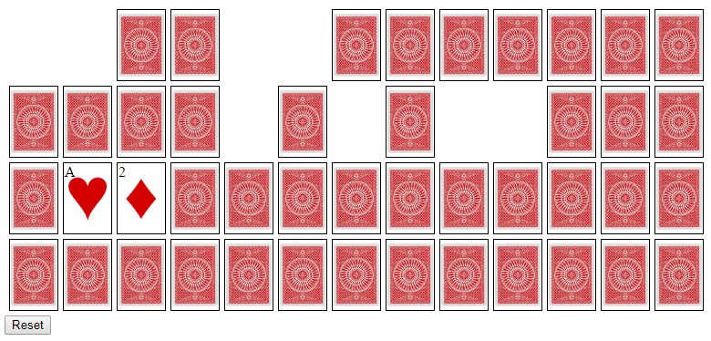

# Memory Game in JavaScript

This is the Memory card game implemented in HTML/CSS/JavaScript with tests written in QUnit.

The deck of 52 cards is dealt face down.  The player may flip two cards face up each turn.  If the face values match, the cards are removed.  The goal is the remove all of the cards in the least number of moves possible.  Remembering what cards have previously been flipped and where is the key!

## Running the Game

Clone the repository, then double-click on the `index.html` file.

## Running the Unit Tests

Clone the repository, then double-click on the `tests.html` file.

## Supported Browsers

* Chrome
* Firefox
* Internet Explorer 11